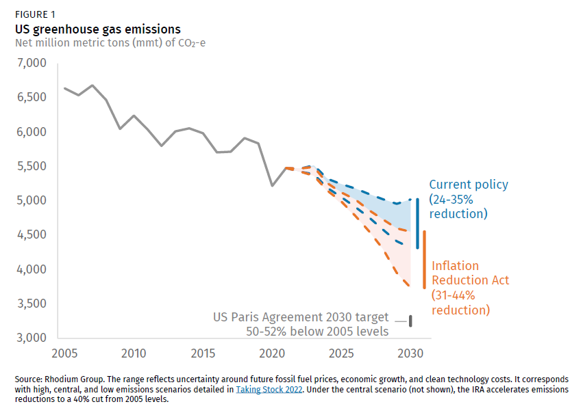
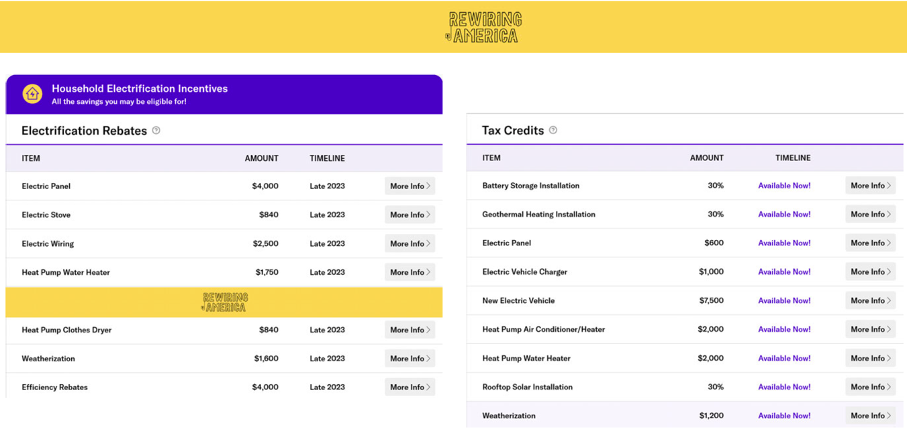

A lot of us in the climate space tend to celebrate the Inflation Reduction Act (IRA), and with good reason. The emergence of the US’s first true climate change law marks a step forward that will hopefully have positive cascading effects for years to come. However, far fewer have an understanding of what the IRA actually contains, how it will be implemented, and the discourse surrounding the mega-bill. This article aims to give the reader a better understanding of what the bill contains, how it will be used, and why it is so talked about.

**What Does the IRA Contain?**

Broadly, the IRA offers $500 billion in funding to specific target initiatives/industries related to climate change and decarbonization. Clean energy development, carbon capture, environmental justice, infrastructure development, and interestingly, American-manufactured goods (more on that later) are all major focuses of the bill. The design of the policy is essentially one giant subsidy package for relevant industries, offering tax incentives, loan guarantees, and grants for eligible projects. [This YouTube video offers a great visual breakdown of funding streams](https://www.youtube.com/watch?v=qw5zzrOpo2s).

**What are the Projected Emissions Impacts of the IRA?**

[An influential initial report by the Rhodium Group](https://rhg.com/research/inflation-reduction-act/) displays the US emissions reduction scenarios that the IRA may result in, compared with that of only pre-IRA policies.

The range of emissions reductions is substantially wide at 31-44%. Rhodium cites “uncertainty around fossil fuel prices, economic growth, and clean technology costs” as some of the contributors to this range. However, another massive contributor to the impact of the IRA will be states’ willingness to utilize funds and foster green investment, which brings us to the topic of implementation.

**How Will the IRA Be Implemented?**

The implementation of the IRA will look slightly different for each entity looking to secure funding. For private companies, the main incentive for investment into an IRA-specified area would be tax credits. [The already existing clean energy Investment Tax Credit was extended](https://home.treasury.gov/system/files/136/Fact-Sheet-IRA-Equitable-Clean-Energy-Economy.pdf) by the IRA, providing an additional 30% credit for renewable energy projects. To qualify, all projects must meet environmental, labor, and equity standards as specified by the IRA.

These tax breaks do not aid government agencies or non-taxed entities, which is why the IRA has established the [Direct Payment Provision](https://www.nlc.org/article/2022/09/23/inflation-reduction-act-clean-energy-project-eligibility-for-local-governments/#:~:text=Through%20the%20direct%20payment%20provision,or%20purchasing%20qualifying%20commercial%20vehicles). The same standards for equity and worker rights apply, but it is hoped that this mechanism (which will be disbursed in the form of low-interest loans and grants) will encourage local governments to develop new projects using IRA funding.

Individual citizens qualify for several significant tax breaks, most notably for EV purchases and/or residential electricity upgrades. However, getting these tax credits may be easier said than done. Take a look below at a [tax incentive cost calculator from Rewiring America](https://www.rewiringamerica.org/app/ira-calculator).

It is fair to assume that many would be overwhelmed by this amount of information and work required to maximize benefits. [Helpful guides like this one](https://www.nytimes.com/interactive/2023/climate/tax-breaks-inflation-reduction-act.html) from the New York Times are great tools to help you maximize your tax benefits, and thus maximize the impact of the IRA.

**How has the IRA been Perceived Globally?**

A notable aspect of the IRA is that it is unquestionably an “America First” bill. Huge provisions have been made to incentivize products that are made on American soil. For example, the aforementioned EV tax credit awards up to $7500 as a tax write-off for consumers who buy an eligible EV. In this case, eligible EVs have to be assembled in America, and the EV batteries have to meet certain quotas of production on American soil. [This has left countries like South Korea furious](https://bipartisanpolicy.org/blog/ira-ev-tax-credits/) as their cars (notably Hyundai and Kia) would not be eligible for the tax credit, thus making them far less competitive in the set-to-explode American EV market. [The EU and China have expressed similar concerns](https://www.carbonbrief.org/media-reaction-us-inflation-reduction-act-and-the-global-clean-energy-arms-race/), and continue to evaluate their options for participation. This provision of the IRA was very intentional, with the goal being to attract investment from foreign manufacturers onto American soil. Whether or not this is going to work remains to be seen over the coming years.

**Conclusion**

This was just a brief description of some of the contents and discourse surrounding the IRA. No matter your opinion, it is plain to see the massive global impact that this bill has already had and will continue to have. The true climate and economic impacts will only emerge over time, but Joe Biden has high hopes that the bill will go on to cement his legacy as “The Climate President.”

---

_Derek Jones is a graduate student studying Energy Policy and the Energy Transition at the University of Pennsylvania._
