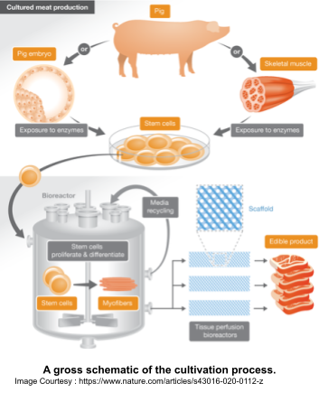

With an anticipated [70% increase](http://www.fao.org/fileadmin/templates/wsfs/docs/Issues_papers/HLEF2050_Global_Agriculture.pdf) in global meat demand from [350 million tons](https://www.theworldcounts.com/challenges/consumption/foods-and-beverages/world-consumption-of-meat/story) to a whopping 570 million tons by 2050, we can not meet international meat demands in the coming decades. What’s more, the [land allocated](http://www.fao.org/3/ar591e/ar591e.pdf) for livestock cultivation is also purported to rise to a staggering 30% of the Earth’s surface by 2050. The situation is serious enough today—a [2020 survey](https://www.aspca.org/shopwithyourheart/business-and-farmer-resources/aspca-surveys) shows that 77% of consumers are concerned about inadequate livestock welfare in the meat industry. All this, while the emissions from livestock account for 14.5 percent of greenhouse gas emissions worldwide.

It’s clear the current state of cultivation and consumption is not sustainable. And while plant-based protein alternatives serve as a possible solution, [surveys show](https://foodinsight.org/wp-content/uploads/2020/01/IFIC-Plant-Alternative-to-Animal-Meat-Survey.pdf) 50% of meat consumers have not yet tried these alternatives, the majority citing concerns about taste, texture, and nutrition as barriers to consumption. But—imagine if this system changed: if we could put a steak on everyone’s plate and if we could do it without hurting a single cow. With the advent of cultured meat technologies, this scenario is increasingly becoming a reality.

What is cultured meat? In a nutshell, cultured meat is meat grown from a small sample of cells harvested from a single animal. [Early environmental impact estimates](https://pubs.acs.org/doi/10.1021/es200130u) of cultured meat already show that the land and water use required only 1% of conventional meats. Moreover, cultured meats also pose a significant public health benefit by preventing fatal infections associated with traditional meat consumption - an issue [avoided](https://www.foodsafetynews.com/2017/01/clean-safe-humane-producers-say-lab-meat-is-a-triple-win/) with properly sanitized cultured meat production.

The first demonstration of this technology took place in 2013 when [Dutch researchers](https://www.eatthis.com/lab-grown-meat/#:~:text=The%20short%20history%20of%20meat,of%20billions%20of%20cow%20cells.) managed to create the first lab-grown meat burger. The only issue? It cost nearly $300,000 to make! Despite the high price, more than [70 private companies](https://gfi.org/resource/cultivated-meat-eggs-and-dairy-state-of-the-industry-report/) have followed suit, building out their infrastructure for large-scale cell-based meat cultivation: one cell-based meat company, [UPSIDE Foods](https://www.upsidefoods.com/news), claims that they have already succeeded at producing a [scalable industrial reactor](https://www.fooddive.com/news/upside-foods-cultivated-cell-based-meat-plant-epic/609182/) to produce meat; another startup [EAT JUST](https://www.greenqueen.com.hk/breaking-eat-just-wins-worlds-first-regulatory-approval-for-cell-based-meat-in-singapore/) has already received approval to sell its cultivated chicken in Singaporean restaurants; and one startup, [Finless Foods](https://finlessfoods.com/about/#products), has succeeded in producing cultivated tuna and is working on other cell-based seafood products. However, the fact stands that the production price needs to go down—people have a limited appetite for $500 hamburgers. However, one [techno-economic analysis](https://cedelft.eu/publications/tea-of-cultivated-meat/) showed the production price could see a 4,000 fold reduction from $10,000 to $2.50 per pound ‘meat’ over the next nine years, of which would be primarily attributed to projected reductions in cell maturation and differentiation costs involved with texture optimization.

## The Technology

Growing a handful of cells into meat is a complex process that several startups are optimizing. Here’s a glimpse into how it all works:

1. **Source**: The process of producing lab-grown meat begins with a [cell line](https://gfi.org/science/the-science-of-cultivated-meat/deep-dive-cultivated-meat-cell-lines/) of the desired animal. The culture source usually comes from a biopsy, in which a sample of [stem cells](https://medlineplus.gov/stemcells.html#:~:text=Stem%20cells%20are%20cells%20with,repair%20system%20for%20the%20body.&text=They%20are%20unspecialized%2C%20so%20they,blood%20cells%2C%20and%20brain%20cells) is extracted from a specific part of the animal’s body. One cellular agriculture startup [Orbillion Bio](https://www.foodnavigator-usa.com/Article/2021/05/17/Orbillion-Bio-founder-on-scaling-up-cell-cultured-meat-We-need-smart-people-money-and-time-and-this-will-be-solved.-I-have-no-doubt-about-it) specializes in handpicking and supplying cell lines from [heritage breeds](https://homestead.motherearthnews.com/heritage-breeds-matter/) optimized for culture growth.
2. **Seed**: Different types of stem and [“progenitor” cells](https://www.technologynetworks.com/cell-science/articles/what-are-progenitor-cells-exploring-neural-myeloid-and-hematopoietic-progenitor-cells-329519#:~:text=Progenitor%20cells%20are%20descendants%20of,the%20same%20tissue%20or%20organ.) are grown in dishes to build up a comprehensive mimic of meat: a mix of fats, muscle, blood vessels, nerves, and fibrous tissue to be modeled in a meat-like architecture. These stem cells can rapidly replicate and expand to levels required for the production of solid meat - that is, when provided the right environment to flourish.
3. **Grow**: All cells, of course, need a place to grow. Enter the [culture media:](https://www.nature.com/articles/s43016-020-0112-z#Sec4) a broth of growth factors, amino acids, fats, sugars, and more. The culture medium supports cell growth but can also contain expensive and unethical components such as fetal bovine serum (FBS), which comes from the fetuses in slaughtered pregnant cows. Startups, such as [CellulaREvolution](https://www.cellularevolution.co.uk/) and [Biftek](http://biftek.co/#services) are looking to solve this problem by inventing serum-free smart protein coatings as well as plant-based serum alternatives. These techniques boast significant cost reductions and are currently being made available to many cultivated meat startups.
4. **Proliferate**: Once grown, the cells are transferred into [bioreactors](https://www.nature.com/articles/s43016-020-0112-z#Sec5), which simulate the optimal growing conditions inside a living animal. But the cells can’t be placed into any standard incubator—the bioreactor must be selected for the type and sensitivity of cells being nurtured due to the different conditions of each bioreactor class. One UK-based startup [Cellular Agriculture](https://www.cellularagriculture.co.uk/) is developing a unique bioreactor optimized for cultured meat-cell types for scalable production.
5. **Mold**: To shape the cultured masses in the desired architecture, cells must be seeded into a scaffold. The scaffold, usually composed of degradable biomaterials, serves as a mold of sorts onto which cells can adhere and expand. There are numerous innovative approaches to scaffolding technologies developed by cultivated meat startups: using algae-based materials by US-based [Seawith](http://seawith.net/en/), a fungal mycelium approach employed by [Excell](https://www.excell.bio/), and the combination of various edible biomaterials with electrospinning technology developed by [Matrix Meats](https://www.matrixmeats.com/).
6. **Finishing Touch**: To replicate the taste meat eaters enjoy in steak or chicken breasts, cultured muscle tissues are [stretched and zapped with electric current](https://gfi.org/science/the-science-of-cultivated-meat/), both of which stimulate the production of many proteins involved with the relish and color. Once the meat is processed and cooked, we can finally take a bite out of our lab-grown hamburger!

## Perfectly Sustainable?

Many have raised concerns about whether lab-grown meat is as sustainable as it promises. [Hanna Tuomisto](embopress.org/doi/full/10.15252/embr.201847395), a professor at the Helsinki Institute of Sustainability Science, cautioned that “the greenhouse gas emissions associated with cultivated meats is significantly higher than plant protein substitutes [such as tofu and seitan].” She explains that “comprehensive data is not yet available, and the impact of large-scale processing could greatly increase the environmental impact of cultured meat.” One related [study](https://www.ox.ac.uk/news/2019-02-19-lab-grown-meat-really-better-environment) from the ‘LEAP’ program in the Oxford Martin School also concluded that the climate impact of cultivated meats is not as positive as it seems; a variety of complex inputs (i.e., bioreactor energy sources and culture media) need to be considered to evaluate its long term impact on the environment. However, the development of inputs and the development of the product must go hand-in-hand; Due to their interdependence, putting the spotlight on cultured meats in the coming years could accelerate the growth of sustainable inputs in the cultivation process.

## Rules and Restrictions

The regulatory framework in most countries is also a formidable challenge for the adoption of cultured meats. Even among meat substitutes, cultured meats face a significant barrier to market entry and are only approved for human consumption in Singapore. Focusing on the US, the administrative responsibilities of cultivated meats are assigned to the FDA and US Department of Agriculture’s Food Safety and Inspection Service (USDA-FSIS)— an organization instituted to [protect the public's health](https://www.fsis.usda.gov/about-fsis) by ensuring the safety of meat, poultry, and egg products. Together, they will have to regulate and approve the various components of the cultivation process, which involves thorough safety assessments and ethical reviews. Further complications could arise when genetically modifying cells for different optimization purposes, as this could warrant additional FDA regulations similar to those that strictly oversee GM animals. The FSIS agency also has drafted regulations to standardize and qualify the labeling of cell-based meat products, which uses [language](https://www.fda.gov/news-events/press-announcements/statement-usda-secretary-perdue-and-fda-commissioner-gottlieb-regulation-cell-cultured-food-products) like ‘cultivated’ or ‘cell-cultured.’ This is to clearly distinguish it from conventional meat products and prevent any confusion in classification.

## What’s in a Name?

The labeling restrictions that lab-based meats face tie almost directly into the associated consumer acceptance barrier. [Numerous surveys](https://www.nature.com/articles/s43016-020-0112-z/tables/4) show that only 15-25% of US/UK adults eat cultured meats while 30-40% are uncertain. Interestingly, this proportion inverted when the survey asked if participants would eat ‘in vitro’ or ‘clean’ meat. Another [2021 poll](https://gfi.org/resource/consumer-insights/) showed that a majority of the companies in the industry are planning to market their product with the familiar ‘cultivated’ descriptor. Based on the name and description, [many consumers](https://www.mdpi.com/2076-3417/10/15/5201/htm#:~:text=The%20safety%20of%20cultured%20meat,which%20invoke%20more%20positive%20associations.) anticipate that cultured meats will have a poorer taste, nutritional value and are more expensive than traditional meats. What’s more, [neophobia](https://www.mdpi.com/2076-3417/10/15/5201/htm#:~:text=The%20safety%20of%20cultured%20meat,which%20invoke%20more%20positive%20associations.) involving the novel technology involved and fears of displacing demand for conventional meat are also pressing concerns consumers will have in buying cultured meat. The focus needs to be placed on the societal benefits and similarities to conventional meat when marketing the product. These and more present challenging hurdles are confronting cultured meat as it moves from the lab to the dinner table.

## Looking Ahead

Regardless of the complications and challenges, cultured meat will undoubtedly be part of the protein industry’s sustainable future. [Technological advancements](https://gfi.org/science/the-science-of-cultivated-meat/) in cell culture, stem cell biology, tissue engineering, and bioprocess engineering continuously optimize the cultivation process towards crafting the ideal end product. Clean, ethical, and highly sustainable, cultivated meats should be a no-brainer to [many consumers](https://paperpile.com/shared/EQSX9c) when they reach markets. Amidst the many uncertainties presented by climate change, cultured meat promises a reliable source of animal protein for decades to come. In the words of [EAT JUST CEO Josh Tetrick](https://www.theguardian.com/food/2021/jun/16/eat-just-no-kill-meat-chicken-josh-tetrick), “We need a permanent solution to agricultural sustainability, an endgame. Cultured meat is the most likely pathway for this to happen.”
