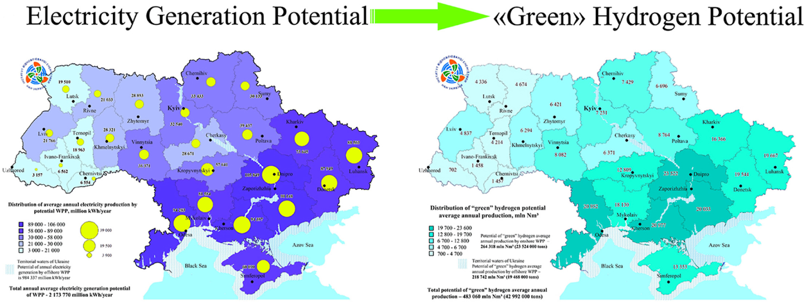
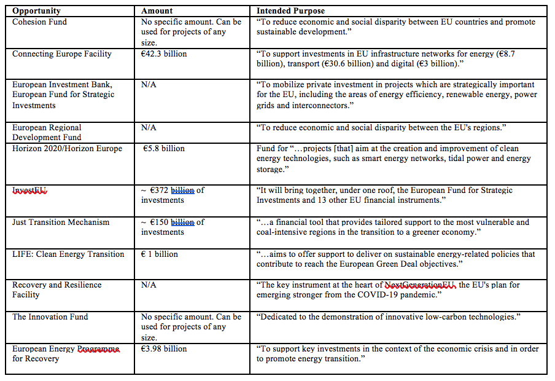

On February 24th, 2022 at 3 o’clock in the morning, Ukraine disconnected its electricity grid from the Russian grid. This was part of a scheduled test to see how Ukraine’s grid would function in “island mode,” a state necessary in the eventual conversion to part of the European Network of Transmission System Operators for Electricity (ENTSO-E; think of this essentially as the EU’s power grid). At 5 o’clock on the same morning, Russia invaded This eliminated the prospect of reconnecting to the Russian grid, [driving a massive and immediate effort to connect with ENTSO-E indefinitely](https://www.bakerinstitute.org/event/webinar-conversation-maxim-timchenko-ceo-ukraines-dtek-0).

You may have already been aware that Ukraine’s electricity grid has been connected to the EU’s grid. What may not have been apparent to those new to the situation is that Ukraine and the EU have been working towards grid interconnection since at least 2005, and the invasion of Ukraine by Russia has, out of necessity, accelerated this interconnection process. Grid interconnections are technologically, politically, and economically complex even within one’s own borders. These challenges are amplified by the fact that the EU and Ukraine’s electricity markets, cultures, and national goals are different in many ways. This blog post will aim to answer the following questions: Why would the EU and Ukraine want to interconnect grids in the first place? What is the current state of this project? What are the remaining challenges and opportunities stemming from this project?

**Why do Ukraine and the EU want interconnection?**

The prospect of interconnection may at first appear to be of much more benefit to Ukraine than the EU as a whole. After the dissolution of the Soviet Union, the new nation of Ukraine inherited the Soviet infrastructure that happened to be within its borders, including the electricity grid. This grid was originally part of the Soviet Union, and as a result remained connected to Russia. This somewhat non-consensual relationship has plagued Ukraine’s (and many other post-Soviet nations’) energy security for decades, due to its predisposition to Russian influence. [An example of this came in 2016](https://www.wired.com/2016/03/inside-cunning-unprecedented-hack-ukraines-power-grid/) when Russia covertly conducted cyber attacks on the Ukrainian grid, potentially as a response to Ukraine’s efforts to nationalize their power grid. The main takeaway here is that Ukraine could greatly increase its energy security by disconnecting from the Russian grid.

Beyond measures for increasing national security, there are economic reasons for interconnection. Ukraine would hope to shift from a monopoly-heavy, corrupt, and over-regulated electricity market to a more liberalized and competitive electricity market. Joining the ENTSO-E would be a step toward this, [as certain amounts of market liberalization are required by EU policy](https://www.swp-berlin.org/publications/products/comments/2021C57_ConnectingUkraine.pdf).

A notable benefit that is attractive to both Ukraine and the EU comes in the form of potential carbon emissions reductions. Within the EU there are challenges related to developing large-scale renewable energy projects, such as inadequate resource potential, a long and arduous permitting process, and opposition from communities (“Not in my backyard” mentality). Increased interconnectivity with Ukraine [is viewed by the EU](https://energy.ec.europa.eu/topics/infrastructure/electricity-interconnection-targets_en) as a way to transport valuable clean energy electrons from suitable generation locations to demand centers throughout Europe. Ukraine fits the bill for this goal. Endowed with rich potential for wind resources, [it has great potential for wind-to-hydrogen production, which could use existing oil/gas infrastructure to send green hydrogen throughout the EU](https://www.sciencedirect.com/science/article/pii/S0360319920336818?via%3Dihub). This type of relationship could be a “win-win,” allowing the EU to import clean energy while simultaneously providing Ukraine with the opportunity to rebuild its formerly Russian fossil-dependent economy.

_Figure 1. A depiction of the potential for wind energy-to-hydrogen projects within Ukraine. Developed by Kudria, S., Et al, 2021. https://doi.org/10.1016/j.ijhydene.2020.09.211_

The technological integration (in this case, the electricity grid) would lead to increased geopolitical alignment and reliance upon the EU from the Ukrainian perspective. This can be viewed either positively or negatively based on the individual or nation’s worldview. Ukraine has been clear about its desire to further align with the EU, [even submitting an application to join NATO in September 2022](https://www.nytimes.com/2022/09/30/world/europe/ukraine-nato-zelensky.html). However, from [the Kremlin’s perspective](https://www.reuters.com/world/europe/kremlin-ukraines-nato-ambitions-remain-threat-russia-2022-09-14/), this alliance would likely be viewed as a direct threat to Russian borders and an embarrassing defeat for the Putin regime.

**What progress has been made?**

In 2005, Ukraine and the EU took their first official step towards interconnection by signing a [Memorandum of Understanding (MoU)](https://energy.ec.europa.eu/system/files/2017-11/mou_strategic_energy_partnership_en_signed_0.pdf). While vague in terms of specific actions, the MoU officially aimed to achieve “full integration” of the EU and Ukrainian energy markets, and was [reconfirmed in 2016](https://www.swp-berlin.org/publications/products/comments/2021C57_ConnectingUkraine.pdf). In 2017, Ukrenergo, Ukraine’s large, state-owned utility, [signed an agreement with ENTSO-E](https://www.entsoe.eu/news/2017/07/07/entsoe-ce-agreement-conditions-future-grid-connections-with-ukraine-moldova/) committing to achieve synchronization with the Continental Europe Synchronous Area (CESA). Synchronization of power systems is one of the largest technological hurdles associated with grid interconnection and is [well documented as such](https://energypedia.info/wiki/Technical_Aspects_of_Grid_Interconnection). This agreement marks an important distinction that needs to be contextualized: many agreements regarding interconnection took and continue to take place between the Utilities and Transmission Operators, not necessarily the government of a given country. In the case of Ukraine, the utilities are de-facto state entities. However, this is not always the case in many EU countries, which have far more liberalized electricity markets. Because of this, the 2017 agreement had [important provisions committed to](https://www.entsoe.eu/news/2017/07/07/entsoe-ce-agreement-conditions-future-grid-connections-with-ukraine-moldova/) “…achieving legal and regulatory alignment with EU rules and regulations.” The 2017 agreement aimed for complete grid synchronization by 2023, though we now know this synchronization was accelerated out of necessity and was fully achieved on March 16th, 2022, a feat many thought to be impossible. However, this accelerated connection will likely prove to be of extreme importance going forward.

**Opinion: What to do next?**

An exhaustive list of technological, geopolitical, and economic barriers related to the challenges remaining in the EU-Ukraine grid interconnection project would be far beyond the scope of a single blog post. Beyond this, the war itself adds too much uncertainty to be able to accurately predict what the status of grid interconnection projects will be in the near future, especially since [Russia has been deliberately targeting electricity transmission and generation facilities for months now](https://www.cnn.com/interactive/2023/02/europe/putin-ukraine-energy-infrastructure-attack/index.html). However, when the war does eventually end and we are left a Ukrainian grid in an unknown state of destruction, I cannot help but think of the famous quote from Winston Churchill: “Never let a good crisis go to waste.” The fact of the matter is that large portions of Ukraine’s grid will need to be reconstructed, so why don’t we do it with the facilitation of clean energy in mind? Ukraine will have to reposition its economy after presumably losing its former backbone (Russian fossil fuel transit), and the EU wants to import lots of new clean energy by 2030, so why not partner to establish Ukraine as one such supplier to the EU? This could be done using any number of existing funding opportunities:

_Table 1. EU Funding Opportunities (European Commission, 2022)._

Am I suggesting that this process would be the easiest profit-maximizing solution? No. Am I suggesting that the EU and Ukraine stop using fossil fuels altogether? Absolutely not. But I am suggesting that the destruction of the power grid, the subsequent need to rebuild that grid, and the desperate need for sustainability in the global energy system just may come together to present a perfect catalyst for unprecedented international cooperation on this issue.

---

_Derek Jones is a graduate student studying Energy Policy and the Energy Transition at the University of Pennsylvania._
