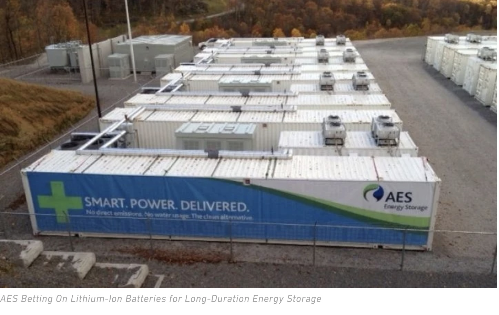

What do electric toothbrushes, construction equipment, and Tesla vehicles have in common?

The answer is a term that has assumed a reputation as an emblem of the transition to clean energy: lithium ion batteries.

Consisting of at least one lithium ion cell per battery, [li-ion batteries](https://www.saftbatteries.com/media-resources/our-stories/three-battery-technologies-could-power-future) (LIBs) are capable of a remarkably high energy density (up to 200 Wh/kg) and charge storage per unit-volume. Energy storage and release is provided by the movement of lithium ions from the positive to the negative electrode back and forth. While the scarcity and extortionate prices of raw materials present a ceiling to the development of LIBs, these batteries have attracted significant interest as enablers of a renewable energy grid system. Thus far, [77%](https://link.springer.com/article/10.1007/s12209-020-00236-w) of electrical power storage systems in the USA that operate to stabilize the grid rely on LIBs, proving to investors that LIB energy storage maintains a high-value market and could bridge the critical gap between power generation and utilization.

That gap is of the utmost importance to technology investors, developers, and innovators in the renewable energy space. Storage for power sources like solar and wind energy is a primary obstacle to the rapid expansion of renewables required to meet the [Biden administration’s goal](https://www.npr.org/2023/02/02/1148370220/biden-renewable-energy-goals) of eliminating fossil fuels as a source of energy for the US by 2035.

The unpredictable output of solar and wind power, shaped by geography and regional meteorology, has placed significant importance on developing an affordable system in which energy produced during peak solar and wind power generation can be stored and used later. Current energy storage solutions are costly, clunky, and often challenging to store: an average solar power storage unit costs $5,000 depending on size. LIBs themselves are highly flammable and prohibitively expensive, with the [likelihood of self-discharge](https://www.mkbattery.com/blog/challenges-solar-energy-storage) increasing as the surrounding air temperature rises past 10C (50F).

_The Lithium Ion Battery Storage facility of [AES Energy Storage](https://www.greentechmedia.com/articles/read/aes-betting-on-lithium-ion-batteries-for-long-duration-energy-storage)._

Enter Viridi Parente, Inc (Viridi). Based out of Buffalo, New York, the company interestingly began on a bet. In 2009, the future founder of Viridi, Jon M. Williams, was visiting the Buffalo NY Medical Campus with the president of New York Power Company and the president of the campus. Interrupted in their conversation by loud, dirty diesel excavators operating outside, the three made a bet. If Williams could create a fully battery powered machine to replace the diesel, then the president of the utility would buy it.

In less than a year, Williams returned with the Viridi’s [Green Machine](https://www.heavyequipmentguide.ca/article/33574/green-machine-bets-on-battery-power). While it initially ran on lead-acid batteries, the introduction of the LIB to the Green Machine in the early 2010s proved advantageous to all; safer, quieter, and unmistakably better for the climate, Viridi’s electric equipment was the company’s entry into the world of lithium-ion electrochemistry. One issue: LIBs were still prone to failure, with disastrous consequences upon self-discharge.

That is, until Viridi built the first ever fail-safe lithium ion battery system. What’s more, they developed the first ever method to test the batteries under extreme conditions.

Testing for the lithium ion technology began in early 2020, with the rps50 design undergoing [two years of rigorous in-house duress testing](https://viridiparente.com/inside-the-first-fail-safe-lithium-ion-battery-system/). Since LIBs are so volatile when exposed to extreme conditions, Viridi employed an independent safety test agency (CSA) to provide the final rps50 UL1973 battery pack testing in mid-2022. The claim of fail-safe carries significant weight, yet the solution to LIB failure fires came in the form of San Diego based [KULR Technology Group’s](https://www.utilitydive.com/news/volta-bets-on-space-technology-for-battery-storage-fire-prevention/611833/) passive propagation resistant (PPR) solution suite, intuitively designed to stop lithium-ion battery failures from spiraling out of control without external fire suppression.

The system prevents cell-to-cell thermal runaway and contains any fire and debris inside a battery pack protection, immediately turning the system off to prevent any spread in damage. This cell-to-cell thermal propagation prevention tech has been used (on a larger scale) for NASA missions, but marks the first PPR entrance into energy storage. Simply, it means that Viridi systems are deployable wherever needed- a revolutionary concept when considering the limitations of the current grid.

What does this mean for the consumer, for the energy grid overall? As it turns out, a great deal.

Viridi and their daughter companies (Volta, Green Machine, etc) have one goal: making energy storage affordable and safe for residents and businesses across the US. Houses with solar panels could run off of the stored LIB energy during peak utility hours, and when cheaper could power their home with energy from their respective utility. The energy users would control the demand side of energy consumption. That point of use energy storage has the potential to more than double the delivered capacity of our entire American energy transmission system, while creating jobs in localized LIB production and without any investments in new grid infrastructure.

It’s important to note that Viridi is not pushing to eliminate the utility, but rather to reach for an equitable and scalable system where supply and demand are equal. Similarly to the [decentralization of Uber](https://decrypt.co/112957/teleport-creators-raise-9m-build-decentralized-uber-rival-solana), point-source energy storage would allow residents to connect directly with the utility and would lessen the [load-loss factor](https://www.nrel.gov/news/features/2019/from-the-bottom-up-designing-a-decentralized-power-system.html) of the growing grid.

To date, Viridi has amassed nearly [$95 Million](https://solarbuildermag.com/batteries/viridi-nets-nearly-100m-for-fail-safe-lithium-ion-battery-tech-in-funding-round/) in Series-C funding, led by investor B. Thomas Golisano. New investors in Viridi Parente’s fail-safe system are also lending significant support to its scalability, such as [National Grid Partners](https://ngpartners.com), the investment arm of National Grid, one of the world’s largest investor-owned energy companies. Viridi has also joined forces with the San-Francisco-based intelligent software manufacturer Bright Machines to digitally transform the company’s lithium-ion battery factory to fit BM’s full-stack assembly automation solution. Accurately nicknamed [“Microfactories”](https://www.brightmachines.com/brightmachines-microfactory/), the integrated full-stack solution modernizes manufacturing by leveraging data and AI, providing Viridi with new digital capabilities to meet the increasing demands for its zero-carbon emission energy battery solutions. The Ashtead Group/[Sunbelt Rentals’](https://www.sunbeltrentals.com) investment into Viridi/Green Machine’s construction-approved batteries will drastically increase the ability to scale the LIB systems into commercial and residential settings.

Viridi is dedicated to creating the next generation of energy systems by literally charging a new wave of American jobs and serving the ever-increasing demand of the clean energy industry. The shift to point-of-use energy production and green equipment will be a defining factor in the global push towards net-zero, and investors and consumers alike are interested in watching Viridi’s vision come to fruition.

---

_Bronwyn Patterson is a second year student at the University of Pennsylvania studying Environmental Studies with a concentration in Sustainability and Management._
